# resume

Blog : https://ekyu.synology.me/wp/

LinkedIn : https://www.linkedin.com/in/kyeongkyu-lee-9b4241a8/

Github : https://github.com/kyuob/
 
 
## 경력

### Gluesys
- 2016/09 ~ now

### PM Studios
- 2015/05 ~ 2016/08

### Simplatform
- 2014/09 ~ 2015/04

### Deoham Story
- 2014/01 ~ 2014/08

### NCer
- 2012/11 ~ 2013/11
 
 
## Gluesys

### Role:
Senior Software Developer, iOS Main Developer
 
### Development Tools & Languages:
Xcode, Android Studio, Mantis, Redmine, SVN, Git, Linux

Swift, Objective-C, JAVA, C++, C
 
### Projects:
IP camera NVR (network video recorder) solution mobile App development

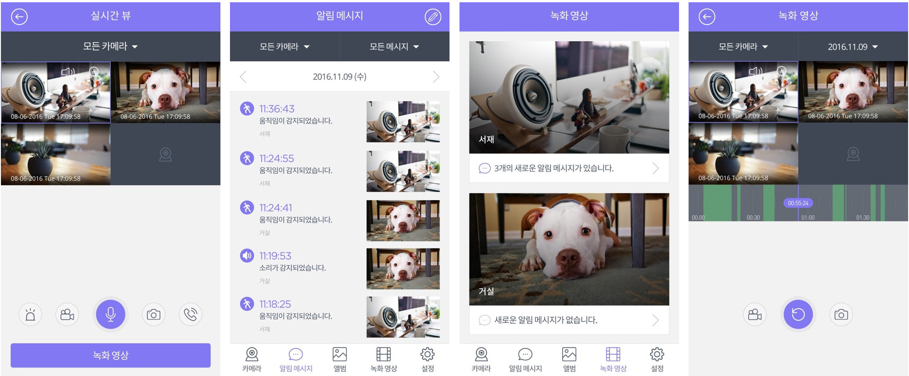

Router Storage device mobile App development

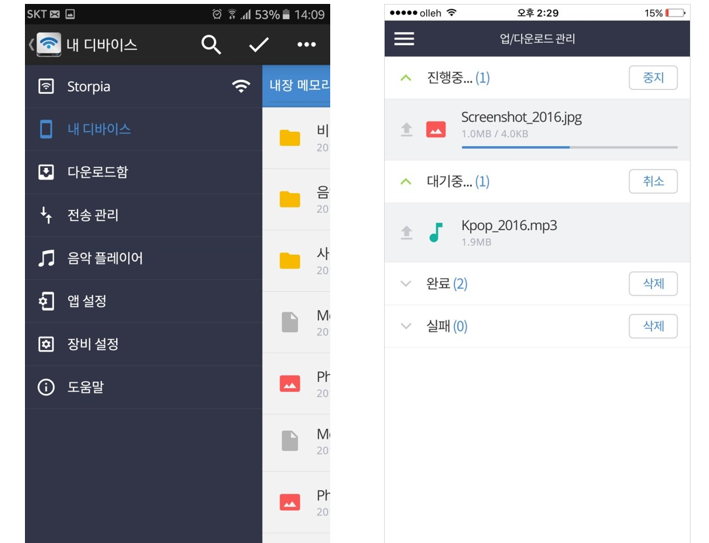

KT GiGAeyes project - platform interworking function development (Linux)

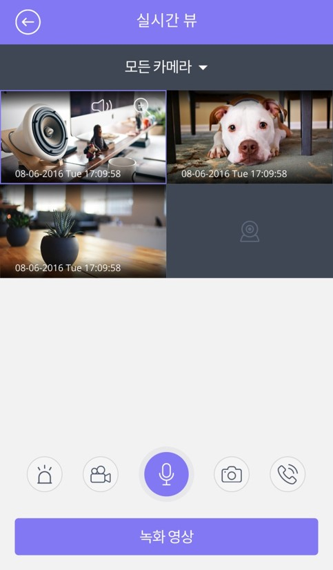 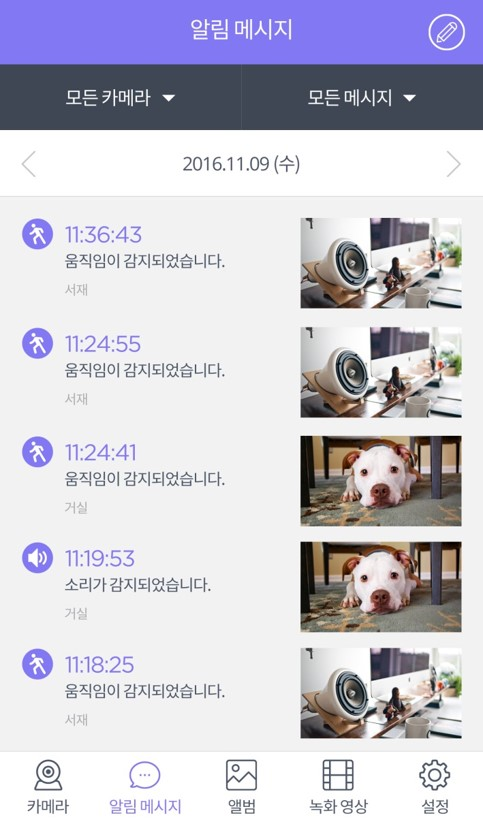

### iOS, Android, NVR, NAS

http://gluesys.com/product-2/mobile-storage/?lang=en
 
 
## PM Studios

### Role:
Senior Software Developer, iOS Main Developer
 
### Development Tools & Languages:
Xcode, Mantis, Trello, BitBucket, SourceTree

Objective-C, C++, C#
 
### Projects:
Famous game items (LoL, CS, DoTA, Blizzard) betting Social App development

(Global launch, mainly North America)

iOS Main development

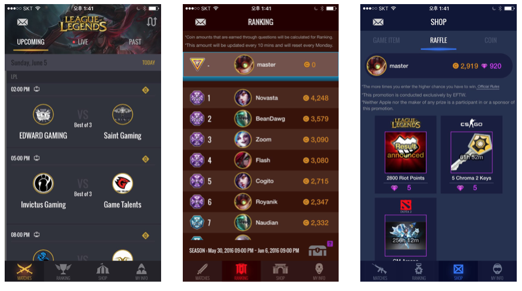

and

Cocos2d-x game development

https://itunes.apple.com/us/app/eftw/id1054299008
 
 
## Simplatform

### Role:
Senior Software Developer
 
### Development Tools & Languages:
Xcode, Eclipse, Redmine, Jira, Git

Objective-C, C ++, C#, Java, JavaScript
 
### Projects:
Financial development(FinTech) paperless e-Form solution R&D

iOS, Android, and Web client solution engine repair and maintenance

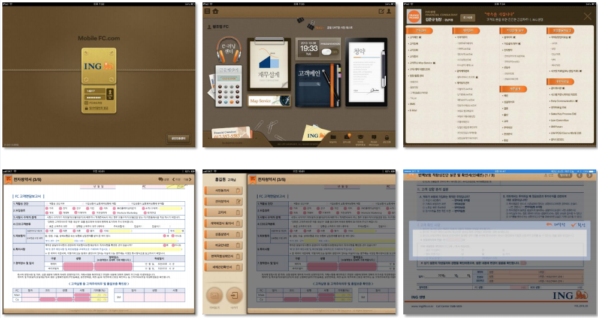

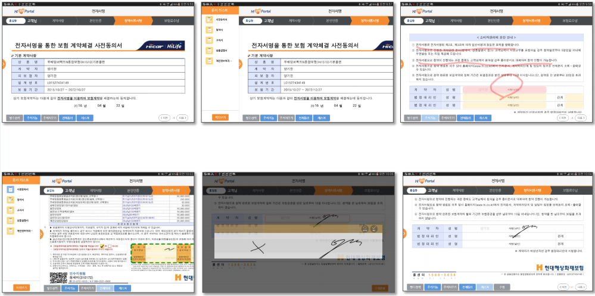
 
 
## Deoham Story

### Role:
Senior Software Developer
 
### Development Tools & Languages:
Xcode, Eclipse, Trello, BitBucket, SourceTree

Objective-C, C ++, Java
 
### Projects:
HYUNDAI Auto Ever DH Genesis App Project

Development of car dealer education app, dealer sales consultation and customer management catalog app

Support for 9 languages
 
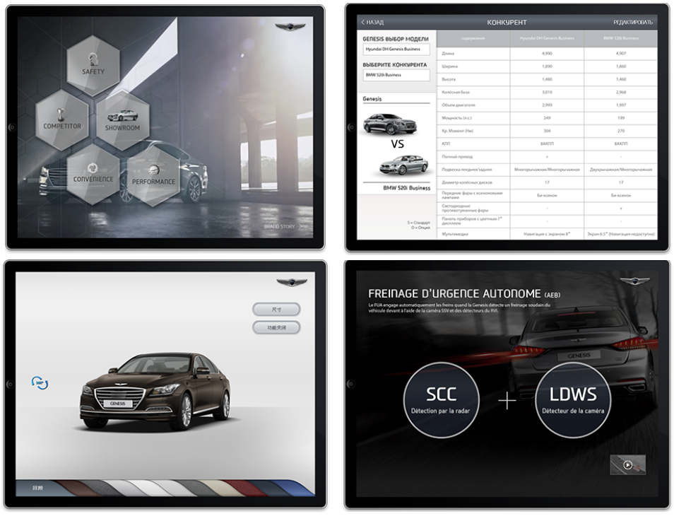

HYUNDAI Auto Ever LMS project for car dealers

Development of LMS iPad and iPhone version for dealer education
 
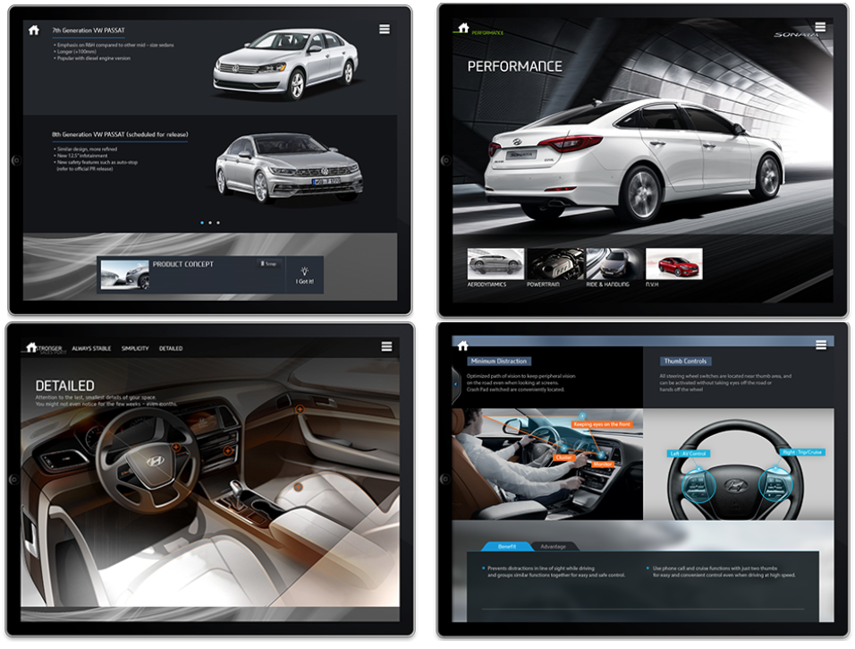

## NCer

### Role:
Senior Software Developer, Core Framework Developer. [Hi Dokdo] App Main Developer.
 
### Team work:
Agile Software Development Environment (weekly release)

### Collaboration Tools :
Jira, Trello, BitBucket, SourceTree, Jenkins
 
### Projects:
CJ-Educations' interactive Educational Mobile Apps (app books) for kids using Cocos2D-x (C++, iOS 6.0, 7.0 and Adroid NDK) for iOS Devices (mainly iPad), and Android Tablets.

[D is for Doodle], [Alphabeasties], [Stella is a Star], [Pass it on], [Do you know which ones will grow?]

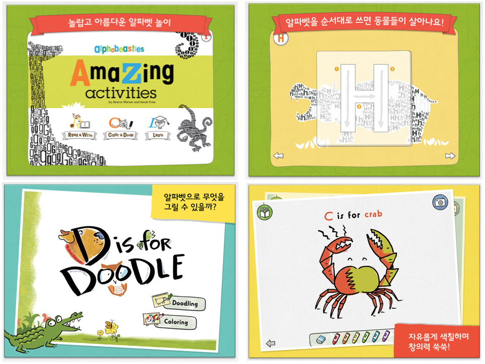

Internal Interactive Mobile App Books using Cocos2D-x(C++, iOS 6.0, 7.0 and Android NDK) for iOS Devices (mainly iPad), Android Tablets.

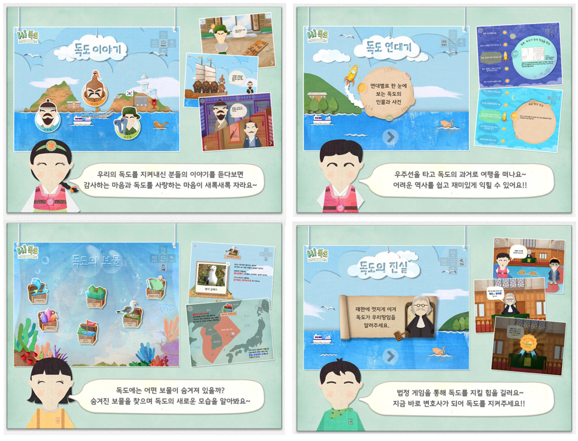
 
