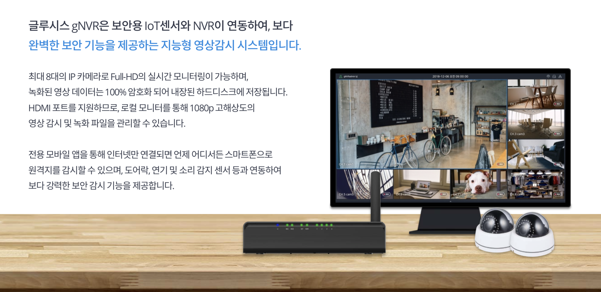

# resume

LinkedIn : https://www.linkedin.com/in/kyeongkyu-lee-9b4241a8/

Github : https://github.com/kyuob/
 
 
## 경력

### Dal.komm - beat corp
- 2019/07 ~ now

### Gluesys
- 2016/09 ~ 2019/06

### PM Studios
- 2015/05 ~ 2016/08

### Simplatform
- 2014/09 ~ 2015/04

### Deoham Story
- 2014/01 ~ 2014/08

### NCer
- 2012/11 ~ 2013/11 
   
   
## Dal.komm - beat corp

### 직무:
Senior Software Developer, iOS Main Developer
 
### 사용 언어, 협업 툴:
Xcode, Jira, Confluence, Git

Swift, Objective-C
 
### 프로젝트:
b;eat 로봇 카페 iOS 앱 개발 100% 관여 
2020년 2.0 100% 네이티브 앱
2022년 3.0 하이브리드 앱

Dal.komm 카페 iOS 앱 개발 100% 관여

## Gluesys

### 직무:
Senior Software Developer, iOS Main Developer
 
### 사용 언어, 협업 툴:
Xcode, Android Studio, Mantis, Redmine, SVN, Git, Linux

Swift, Objective-C, JAVA, C++, C
 
### 프로젝트:
IP camera NVR (network video recorder) 솔루션 모바일 앱 개발

소형 스토리지 기기 관리용 모바일 앱 개발

http://gluesys.com/product-2/mobile-storage/?lang=en

KT GiGAeyes 프로젝트 - 플랫폼 간 연동 기능 개발 (Linux)

 

### iOS, Android, NVR, NAS application development

 
 
## PM Studios

### 직무:
Senior Software Developer, iOS Main Developer
 
### 사용 언어, 협업 툴:
Xcode, Mantis, Trello, BitBucket, SourceTree

Objective-C, C++, C#
 
### 프로젝트:
유명 게임들 (LoL, CS, DoTA, Blizzard) 의 경기 결과 베팅 후
얻은 포인트로 게임들 속의 아이템을 살 수 있는 모바일 앱 개발

(한국 미출시, 북미 위주 글로벌 출시)

iOS 모바일 앱 리드 개발

https://itunes.apple.com/us/app/eftw/id1054299008

그 외

Cocos2d-x 게임 개발 진행
 
 
## Simplatform

### 직무:
Senior Software Developer
 
### 사용 언어, 협업 툴:
Xcode, Eclipse, Redmine, Jira, Git

Objective-C, C ++, C#, Java, JavaScript
 
### 프로젝트:
금융권 전자문서 e-Form 솔루션 R&D

iOS, Android, Web 용 솔루션 유지보수 및 개발

 
 
## Deoham Story

### 직무:
Senior Software Developer
 
### 사용 언어, 협업 툴:
Xcode, Eclipse, Trello, BitBucket, SourceTree

Objective-C, C ++, Java
 
### 프로젝트:
HYUNDAI Auto Ever DH Genesis App Project

딜러들의 고객 관리 앱, 매장용 자동차 카달로그 앱

글로벌 9개 언어 지원
 

HYUNDAI Auto Ever 자동차 딜러들 교육용

iPad 와 iPhone 앱 개발
 

## NCer

### 직무:
Senior Software Developer, Core Framework Developer.
[Hi Dokdo] App Main Developer.
 
### 업무 환경:
Agile Software Development Environment (weekly release)

### 협업 툴 :
Jira, Trello, BitBucket, SourceTree, Jenkins
 
### 프로젝트:
CJ-Educations 유아 교육용 인터렉티브 터치 게임 앱북 개발 
Cocos2D-x 사용, iOS와 안드로이드용 패드 앱 개발

[D is for Doodle], [Alphabeasties], [Stella is a Star], [Pass it on], [Do you know which ones will grow?]

역사 교육용 앱북 개발 
Cocos2D-x 사용, iOS와 안드로이드용 패드 앱 개발

 
