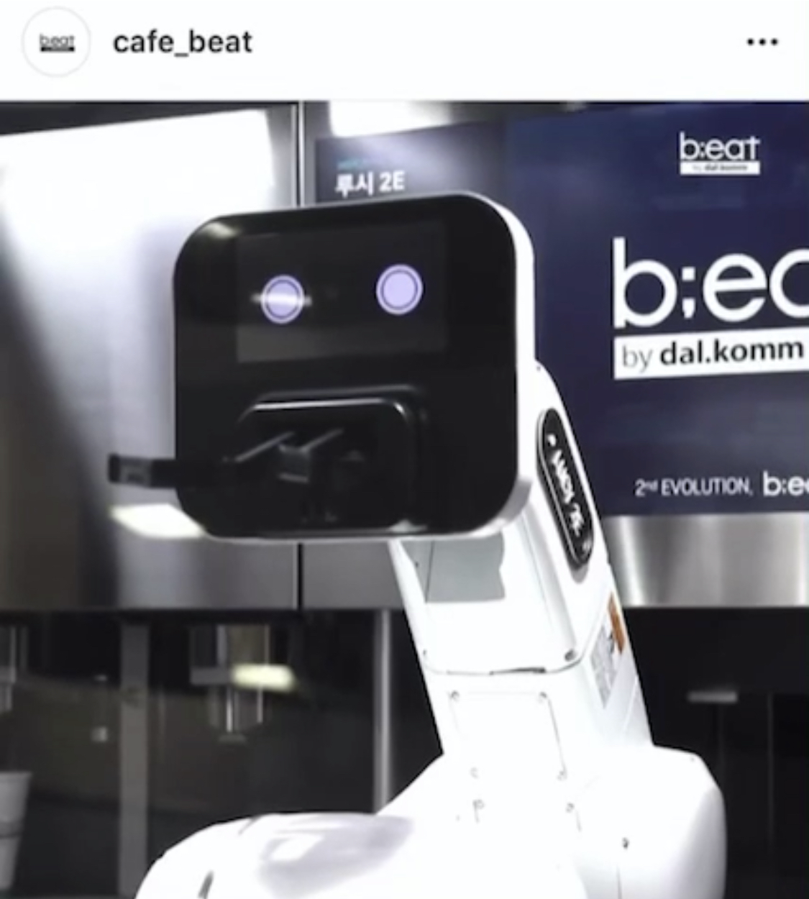
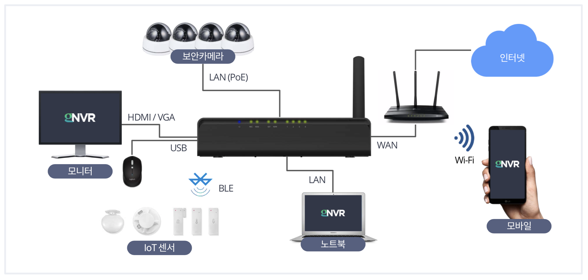
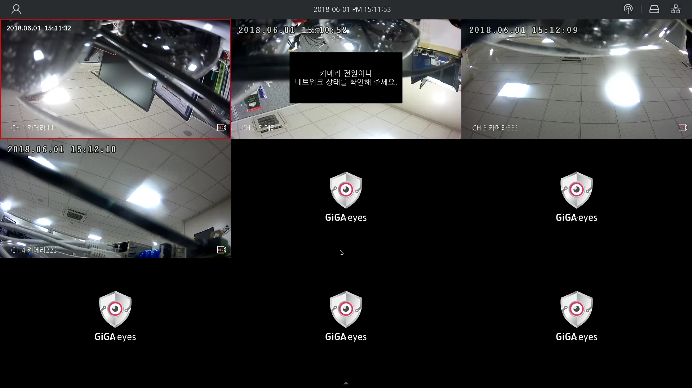

# resume

LinkedIn : https://www.linkedin.com/in/kyeongkyu-lee-9b4241a8/

Github : https://github.com/kyuob/
 
 
## 경력

### Dal.komm - beat corp
- 2019/07 ~ now

### Gluesys
- 2016/09 ~ 2019/06

### PM Studios
- 2015/05 ~ 2016/08

### Simplatform
- 2014/09 ~ 2015/04

### Deoham Story
- 2014/01 ~ 2014/08

### NCer
- 2012/11 ~ 2013/11 
   
   
## Dal.komm - beat corp

### Role:
Senior Software Developer, iOS Main Developer
 
### Development Tools & Languages:
Xcode, Jira, Confluence, Git

Swift, Objective-C
 
### Projects:
b;eat 로봇 커피 고객용 주문 모바일 앱 개발

Dal.komm 커피 고객용 주문 모바일 앱 개발

## Gluesys

### Role:
Senior Software Developer, iOS Main Developer
 
### Development Tools & Languages:
Xcode, Android Studio, Mantis, Redmine, SVN, Git, Linux

Swift, Objective-C, JAVA, C++, C
 
### Projects:
IP camera NVR (network video recorder) 솔루션 모바일 앱 개발

소형 스토리지 기기 관리용 모바일 앱 개발

http://gluesys.com/product-2/mobile-storage/?lang=en

KT GiGAeyes 프로젝트 - 플랫폼 간 연동 기능 개발 (Linux)

 

### iOS, Android, NVR, NAS application development

 
 
## PM Studios

### Role:
Senior Software Developer, iOS Main Developer
 
### Development Tools & Languages:
Xcode, Mantis, Trello, BitBucket, SourceTree

Objective-C, C++, C#
 
### Projects:
Famous game items (LoL, CS, DoTA, Blizzard) betting Social App development

(Global launch, mainly North America)

iOS Main development

https://itunes.apple.com/us/app/eftw/id1054299008

and

Cocos2d-x game development
 
 
## Simplatform

### Role:
Senior Software Developer
 
### Development Tools & Languages:
Xcode, Eclipse, Redmine, Jira, Git

Objective-C, C ++, C#, Java, JavaScript
 
### Projects:
Financial development(FinTech) paperless e-Form solution R&D

iOS, Android, and Web client solution engine repair and maintenance

 
 
## Deoham Story

### Role:
Senior Software Developer
 
### Development Tools & Languages:
Xcode, Eclipse, Trello, BitBucket, SourceTree

Objective-C, C ++, Java
 
### Projects:
HYUNDAI Auto Ever DH Genesis App Project

Development of car dealer education app, dealer sales consultation and customer management catalog app

Support for 9 languages
 

HYUNDAI Auto Ever LMS project for car dealers

Development of LMS iPad and iPhone version for dealer education
 

## NCer

### Role:
Senior Software Developer, Core Framework Developer. [Hi Dokdo] App Main Developer.
 
### Team work:
Agile Software Development Environment (weekly release)

### Collaboration Tools :
Jira, Trello, BitBucket, SourceTree, Jenkins
 
### Projects:
CJ-Educations' interactive Educational Mobile Apps (app books) for kids using Cocos2D-x (C++, iOS 6.0, 7.0 and Adroid NDK) for iOS Devices (mainly iPad), and Android Tablets.

[D is for Doodle], [Alphabeasties], [Stella is a Star], [Pass it on], [Do you know which ones will grow?]

Internal Interactive Mobile App Books using Cocos2D-x(C++, iOS 6.0, 7.0 and Android NDK) for iOS Devices (mainly iPad), Android Tablets.

 
